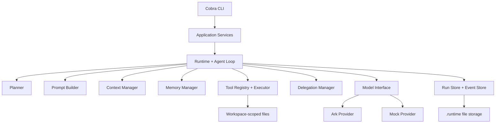
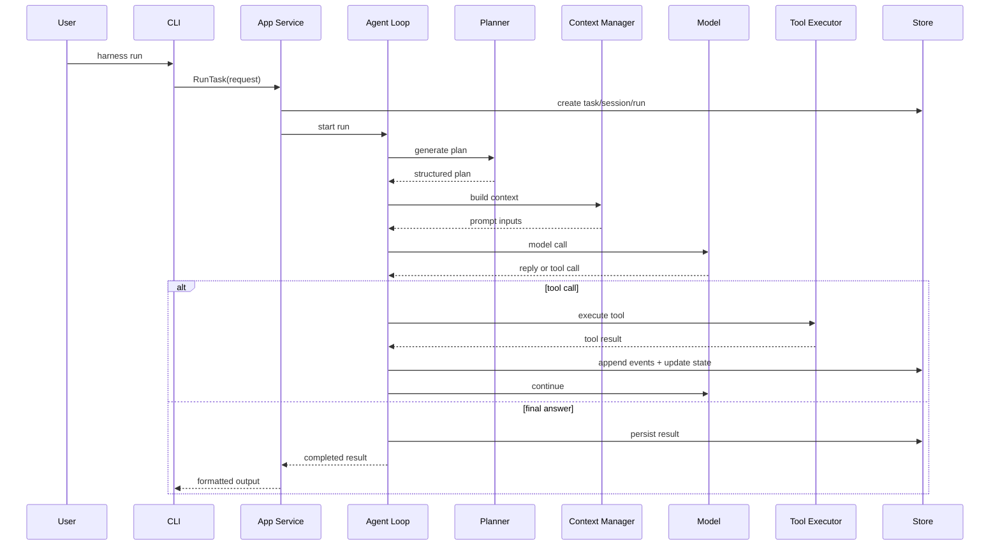

# Agent Harness Platform 技术方案

生成时间：2026-03-25

依据文档：
- `PRD.md`
- `openspec/changes/archive/2026-03-25-bootstrap-agent-harness/proposal.md`
- `openspec/changes/archive/2026-03-25-bootstrap-agent-harness/design.md`
- `openspec/changes/archive/2026-03-25-bootstrap-agent-harness/tasks.md`
- `openspec/changes/archive/2026-03-25-support-multi-turn-chat/proposal.md`
- `openspec/changes/archive/2026-03-25-support-multi-turn-chat/design.md`
- `openspec/changes/archive/2026-03-25-support-multi-turn-chat/tasks.md`
- `openspec/changes/stabilize-harness-runtime/proposal.md`
- `openspec/changes/stabilize-harness-runtime/design.md`
- `openspec/changes/stabilize-harness-runtime/tasks.md`

## 1. 文档目标

本文档将现有 PRD 收敛为一份可直接落地实施的技术方案，重点回答四件事：

- 系统应该如何分层和拆模块
- 运行时核心对象应该长什么样
- 规划、上下文、工具、记忆、子代理如何协同
- 当前 MVP 已经实现到哪一步，以及下一步应如何继续演进

当前仓库现状：

- 仓库已经完成单机本地运行的 Harness MVP
- 已有 Go 模块、Cobra CLI、文件型运行工件、Ark / Mock provider 和最小 plan-driven loop
- 已支持多轮 chat、session message 持久化、受控 delegation、`inspect / replay / resume / debug events`
- 已新增固定场景回归入口 `make verify-scenarios`
- 当前文档目标更偏“实现快照 + 演进说明”，而不是 greenfield 设计草案

因此，本方案会刻意把目录、对象、事件、文件结构和当前 CLI 能力写得更明确，目的是减少后续迭代时的重复设计和文档漂移。

## 2. 目标与约束

### 2.1 目标

- 使用 Go 构建单机本地运行的 Agent Harness 平台
- 支持 `run`、`chat`、`inspect`、`session inspect`、`replay`、`resume`、`tools list`、`debug events`
- 将运行工件统一持久化到 `.runtime/runs/<run-id>/`
- 实现 plan-driven agent loop，串联 planning、context、compaction、memory、tool、delegation
- 同时支持真实 `Ark provider` 和可测试的 `mock provider`
- 提供统一的固定场景回归入口，覆盖基础规划、文件系统工具、多轮 chat 和 delegation
- 为未来的 HTTP、skills、MCP、ACP、消息入口、调度入口保留清晰边界

### 2.2 非目标

- MVP 不做 HTTP API
- 不做多人共享和多租户
- 不做生产级数据库
- 不做开放式自治多代理网络
- 不做工作区外的任意文件或 shell 访问

### 2.3 核心约束

- Go 是唯一实现语言
- Cobra 是首个入口层框架
- 文件型持久化是首版默认方案
- 所有工具访问都必须被限制在 workspace 内
- Event 是系统唯一可信执行轨迹

## 3. 总体架构

### 3.1 架构风格

系统建议采用“分层单体 + 显式运行时边界”的方式实现，而不是微服务。核心分层如下：

- 入口层：CLI
- 应用层：用例编排与服务对象
- 运行时层：Run 生命周期、Agent Loop、状态机
- 能力层：Planner、Prompt、Context、Memory、Tool、Delegation
- 基础设施层：Model Provider、文件型 Store



### 3.2 架构原则

- Event-first：所有关键动作都必须有结构化事件
- App/Core 分离：CLI 不直接操作运行时内部细节
- 合同优先：Plan、Memory、Tool、Delegation 都使用显式结构
- 安全优先：文件写入和路径访问必须受 workspace 边界约束
- 可演进：后续协议和入口扩展通过边界接入，而不是重写核心 loop

## 4. 推荐目录结构

```text
.
├── cmd/
│   └── harness/
│       └── main.go
├── internal/
│   ├── app/
│   │   ├── run_service.go
│   │   ├── inspect_service.go
│   │   ├── replay_service.go
│   │   ├── resume_service.go
│   │   ├── session_service.go
│   │   ├── scenario_regression_test.go
│   │   └── tools_service.go
│   ├── cli/
│   │   ├── root.go
│   │   ├── run.go
│   │   ├── chat.go
│   │   ├── inspect.go
│   │   ├── session.go
│   │   ├── replay.go
│   │   ├── resume.go
│   │   ├── tools.go
│   │   └── debug.go
│   ├── config/
│   │   └── config.go
│   ├── context/
│   │   ├── manager.go
│   │   ├── budget.go
│   │   └── compaction.go
│   ├── delegation/
│   │   └── manager.go
│   ├── memory/
│   │   ├── manager.go
│   │   └── store.go
│   ├── model/
│   │   ├── model.go
│   │   ├── ark/
│   │   │   └── provider.go
│   │   └── mock/
│   │       └── provider.go
│   ├── planner/
│   │   └── planner.go
│   ├── prompt/
│   │   ├── builder.go
│   │   └── templates.go
│   ├── runtime/
│   │   └── types.go
│   ├── store/
│   │   ├── filesystem/
│   │   │   ├── event_store.go
│   │   │   ├── state_store.go
│   │   └── paths.go
│   └── tool/
│       ├── registry.go
│       ├── executor.go
│       ├── types.go
│       └── filesystem/
│           ├── read_file.go
│           ├── write_file.go
│           ├── list_dir.go
│           ├── search.go
│           └── stat.go
├── testdata/
│   └── scenarios/
├── .runtime/
├── docs/
│   └── step1/
│       ├── PRD.md
│       └── TECHNICAL_SOLUTION.md
├── openspec/
└── README.md
```

这样拆分的原因：

- `internal/app` 负责用例，后续 HTTP 或消息入口可直接复用
- `internal/runtime` 放稳定领域对象，避免被入口层带偏
- 当前主执行链集中在 `run_service.go`，后续如果 loop 复杂度继续上升，再独立拆分 `loop/` 目录
- `internal/store/filesystem` 隔离文件型存储，后续替换 SQLite/Postgres 成本更低
- 各能力模块可单测、可替换、可逐步演进

## 5. 核心领域模型

### 5.1 核心对象

#### Task

表示用户当前交给系统的目标。

```go
type Task struct {
    ID          string            `json:"id"`
    Instruction string            `json:"instruction"`
    Workspace   string            `json:"workspace"`
    Metadata    map[string]string `json:"metadata,omitempty"`
    CreatedAt   time.Time         `json:"created_at"`
}
```

#### Session

表示上下文容器。首版即使只有单机单用户，也建议保留 Session 概念，为后续 recall、resume、parent-child run 预留边界。

```go
type Session struct {
    ID         string    `json:"id"`
    Workspace  string    `json:"workspace"`
    ParentID   string    `json:"parent_id,omitempty"`
    CreatedAt  time.Time `json:"created_at"`
    UpdatedAt  time.Time `json:"updated_at"`
}
```

#### Run

表示一次具体执行实例，是 inspect、replay、resume 的核心定位对象。

```go
type RunStatus string

const (
    RunPending   RunStatus = "pending"
    RunRunning   RunStatus = "running"
    RunBlocked   RunStatus = "blocked"
    RunCompleted RunStatus = "completed"
    RunFailed    RunStatus = "failed"
    RunCancelled RunStatus = "cancelled"
)

type Run struct {
    ID              string    `json:"id"`
    TaskID          string    `json:"task_id"`
    SessionID       string    `json:"session_id"`
    ParentRunID     string    `json:"parent_run_id,omitempty"`
    Status          RunStatus `json:"status"`
    CurrentStepID   string    `json:"current_step_id,omitempty"`
    Provider        string    `json:"provider"`
    Model           string    `json:"model"`
    MaxTurns        int       `json:"max_turns"`
    TurnCount       int       `json:"turn_count"`
    CreatedAt       time.Time `json:"created_at"`
    UpdatedAt       time.Time `json:"updated_at"`
    CompletedAt     time.Time `json:"completed_at,omitempty"`
}
```

#### Event

表示不可变执行轨迹。所有调试、回放、审计都以它为准。

```go
type Event struct {
    ID        string          `json:"id"`
    RunID     string          `json:"run_id"`
    Sequence  int64           `json:"sequence"`
    Type      string          `json:"type"`
    Timestamp time.Time       `json:"timestamp"`
    Actor     string          `json:"actor"`
    Payload   json.RawMessage `json:"payload"`
}
```

### 5.2 扩展对象

除核心对象外，还建议补齐以下结构：

- `Plan`
- `PlanStep`
- `Summary`
- `MemoryEntry`
- `ToolCall`
- `ToolResult`
- `DelegationTask`
- `DelegationResult`
- `RunResult`

### 5.3 Plan 结构

```go
type Plan struct {
    ID        string     `json:"id"`
    RunID     string     `json:"run_id"`
    Goal      string     `json:"goal"`
    Steps     []PlanStep `json:"steps"`
    Version   int        `json:"version"`
    CreatedAt time.Time  `json:"created_at"`
    UpdatedAt time.Time  `json:"updated_at"`
}

type PlanStep struct {
    ID               string   `json:"id"`
    Title            string   `json:"title"`
    Description      string   `json:"description"`
    Status           string   `json:"status"`
    Delegatable      bool     `json:"delegatable"`
    EstimatedCost    string   `json:"estimated_cost,omitempty"`
    EstimatedEffort  string   `json:"estimated_effort,omitempty"`
    Dependencies     []string `json:"dependencies,omitempty"`
    OutputSchemaHint string   `json:"output_schema_hint,omitempty"`
}
```

建议：

- `Plan` 要有版本号，便于 replan
- `plan.json` 保存当前视图
- `PlanStep.Status` 首版统一为 `pending`、`running`、`completed`、`blocked`、`failed`、`cancelled`
- 同时写入 `plan.created`、`plan.updated`、`plan.step.started`、`plan.step.completed`、`plan.step.changed` 事件

## 6. 运行工件与存储设计

### 6.1 Run 目录结构

每个 run 拥有独立工件目录：

```text
.runtime/
└── runs/
    └── <run-id>/
        ├── run.json
        ├── state.json
        ├── plan.json
        ├── summaries.json
        ├── memories.json
        ├── events.jsonl
        ├── result.json
        └── children/
            └── <child-run-id>.json

.runtime/
└── sessions/
    └── <session-id>/
        ├── session.json
        ├── messages.jsonl
        └── input.history
```

### 6.2 文件职责

- `run.json`：Run 元信息和生命周期状态
- `state.json`：resume 所需的中间状态
- `state.json` 中当前还会保存 `resume_phase`、`pending_tool_name`、`pending_tool_result` 等续跑状态
- `plan.json`：当前结构化计划
- `summaries.json`：compaction 的 step summary 和 run summary
- `memories.json`：本次 run 的 recall 结果和 memory candidate
- `events.jsonl`：按顺序追加的完整事件流
- `result.json`：最终输出结果
- `sessions/<session-id>/messages.jsonl`：多轮 user / assistant 消息历史
- `sessions/<session-id>/input.history`：TTY chat 的输入历史

### 6.3 持久化原则

- Event 必须 append-only，并且关键动作后立即 flush
- State 可以覆盖写，但必须只在安全 checkpoint 写入
- `resume` 基于 `run.json + state.json + plan.json`，并支持 `post_tool` 阶段恢复
- `replay` 的摘要视图依赖 `events.jsonl` 生成；`debug events` 保留原始事件输出

## 7. 事件模型

### 7.1 必备事件类型

最少建议统一如下事件：

- `run.created`
- `run.started`
- `run.status_changed`
- `task.created`
- `session.created`
- `plan.created`
- `plan.updated`
- `plan.step.started`
- `plan.step.completed`
- `prompt.built`
- `context.built`
- `context.compacted`
- `memory.recalled`
- `memory.candidate_extracted`
- `memory.committed`
- `user.message`
- `assistant.message`
- `model.called`
- `model.responded`
- `tool.called`
- `tool.succeeded`
- `tool.failed`
- `fs.file_created`
- `fs.file_updated`
- `subagent.spawned`
- `subagent.completed`
- `subagent.rejected`
- `result.generated`
- `run.completed`
- `run.failed`

### 7.2 事件负载原则

Event payload 应满足四点：

- 结构化
- 足够小，但能复原关键过程
- 本地可直接 inspect
- 后续可版本化演进

示例：

```json
{
  "tool_name": "fs.write_file",
  "path": "notes/output.txt",
  "overwrite": true,
  "bytes_written": 128,
  "write_mode": "update"
}
```

## 8. 执行链设计

### 8.1 主流程



### 8.2 单轮 turn 的执行顺序

每一轮建议固定按以下顺序执行：

1. 读取当前 active step
2. recall memory
3. 组装 prompt 和 context
4. 检查预算，不足时触发 compaction
5. 发起 model call
6. 解析回复
7. 执行 tool 或生成最终结果
8. 更新 step 状态
9. 写 checkpoint

### 8.3 Resume 策略

`resume` 不应该从头重放，而应该从最近一次安全点继续。

可恢复状态建议包括：

- `pending`
- `running`
- `blocked`

默认不可恢复：

- `completed`
- `failed`
- `cancelled`

恢复时应完成以下动作：

- 校验 run 状态是否合法
- 读取 `state.json`
- 恢复 active step、turn count、上下文摘要
- 从下一安全动作继续执行

## 9. CLI 设计

### 9.1 命令集

```text
harness run <instruction>
harness chat
harness inspect <run-id>
harness session inspect <session-id>
harness replay <run-id>
harness resume <run-id>
harness tools list
harness debug events <run-id>
make verify-scenarios
```

### 9.2 CLI 职责边界

CLI 只负责：

- 参数解析
- 配置加载
- 依赖组装
- 人类可读输出

CLI 不负责：

- 直接更新 run 状态
- 直接操作底层 store
- 绕过 app service 调 runtime internals

### 9.3 建议 flags

`run`：

- `--workspace`
- `--provider`
- `--model`
- `--max-turns`
- `--session`

`chat`：

- `--session`
- `--max-turns`

`session inspect`：

- `--recent`

`replay`：

- 当前更适合输出“摘要时间线”
- 原始事件排障应使用 `debug events`

## 10. Model Provider 设计

### 10.1 统一接口

```go
type Model interface {
    Name() string
    Generate(ctx context.Context, req GenerateRequest) (GenerateResponse, error)
}
```

请求结构建议包含：

- system prompt
- user/task prompt
- tool schema 定义
- context items
- generation config

响应结构建议包含：

- assistant text
- tool calls
- usage metrics
- finish reason
- raw provider metadata

### 10.2 Ark Provider

职责：

- 将内部请求映射到 Ark API
- 将 Ark 响应归一化为内部 `GenerateResponse`
- 记录 usage 信息供事件和调试使用

配置来源：

- `ARK_API_KEY`
- `ARK_BASE_URL`
- `ARK_MODEL_ID`

### 10.3 Mock Provider

Mock Provider 是 MVP 的必需品，不是“测试时顺带做一下”的能力。它至少要覆盖：

- planning 正常路径
- compaction 分支
- delegation 分支
- replay/resume 的稳定性验证

建议支持三种模式：

- 脚本式 response sequence
- fixture 驱动
- 按 task 类型规则返回

## 11. Planner 设计

### 11.1 职责

- 将用户任务转为结构化计划
- 生成边界清晰、可执行的步骤
- 标记可委派步骤
- 在子任务结果或错误出现后支持 replan

### 11.2 接口

```go
type Planner interface {
    CreatePlan(ctx context.Context, input PlanInput) (Plan, error)
    Replan(ctx context.Context, input ReplanInput) (Plan, error)
}
```

### 11.3 MVP 行为建议

- 每个任务默认拆成 3 到 7 步
- 每个 step 必须有明确的输出预期
- 只允许对边界明确的子问题做 delegation
- 不允许无限 planning loop

## 12. Prompt Builder 与 Context Manager

### 12.1 Prompt 分层

Prompt Builder 采用四层模板：

- `base`
- `role`
- `task`
- `tooling`

第一版只启用一个角色模板 `default-agent`，但模板结构先保留完整。

### 12.2 Context 组装顺序

建议按优先级拼装：

1. 稳定系统指令
2. 当前 task 和 workspace 信息
3. 当前 plan 与 active step
4. recall 回来的 memory
5. summary
6. 最近对话与最近 tool 结果

### 12.3 Compaction 设计

Compaction 属于 ContextManager，不属于 MemoryManager。

触发条件：

- token 预算超阈值
- 最近事件过多
- 工具输出过大

产出：

- `step summary`
- `run summary`

要求：

- 结构化存储
- 写入 `summaries.json`
- 发出 `context.compacted` 事件

## 13. Memory 设计

### 13.1 范围

首版 Memory 是结构化长期记忆，不做向量检索。

固定 `kind`：

- `preference`
- `fact`
- `decision`
- `convention`

建议结构：

```go
type MemoryEntry struct {
    ID          string    `json:"id"`
    SessionID   string    `json:"session_id,omitempty"`
    Scope       string    `json:"scope"`
    Kind        string    `json:"kind"`
    Content     string    `json:"content"`
    Tags        []string  `json:"tags,omitempty"`
    SourceRunID string    `json:"source_run_id,omitempty"`
    CreatedAt   time.Time `json:"created_at"`
}
```

### 13.2 Recall 策略

MVP 使用确定性召回：

- 先按 scope、kind、tags 过滤
- 再按稳定优先级排序
- 最后取 Top N

排序建议：

1. session 范围优先于 workspace/global
2. `decision`、`convention` 优先于其他 kind
3. 新写入的优先于旧条目

### 13.3 Write-back 策略

只在以下场景写 Memory：

- run 完成后统一提炼
- 用户显式要求“记住”
- 形成了稳定设计决策

禁止把原始上下文历史整段写入长期记忆。

## 14. Tool Runtime 设计

### 14.1 Tool 接口

```go
type Tool interface {
    Name() string
    Description() string
    Schema() json.RawMessage
    Execute(ctx context.Context, call ToolCall) (ToolResult, error)
}
```

### 14.2 Tool Registry 与 Executor

- `Registry` 负责注册、枚举、查找工具
- `Executor` 负责参数校验、执行、事件记录、结果封装

### 14.3 MVP 文件系统工具

- `fs.read_file`
- `fs.write_file`
- `fs.list_dir`
- `fs.search`
- `fs.stat`

### 14.4 Workspace 边界控制

所有文件系统工具必须：

- 以 workspace root 为基准解析路径
- 在执行前完成路径归一化
- 拒绝越界路径
- 必要时拒绝 symlink 逃逸

### 14.5 安全写入规则

`fs.write_file` 应满足：

- 文件不存在时允许创建
- 文件已存在时只有 `overwrite=true` 才允许覆盖
- 成功写入后必须区分 `fs.file_created` 和 `fs.file_updated`
- Event payload 中要包含相对路径、写入字节数、写入模式

## 15. Delegation 与 Child Run 设计

### 15.1 委派原则

Delegation 是受控子执行，不是开放式 agent spawning。

只有在以下条件同时满足时才允许委派：

- 当前 `PlanStep.delegatable == true`
- 未超过最大深度
- 未超过最大并发
- child tool policy 允许

### 15.2 Child Run 返回结构

每个 child run 必须返回固定结构：

```go
type DelegationResult struct {
    Summary     string   `json:"summary"`
    NeedsReplan bool     `json:"needs_replan"`
    Findings    []string `json:"findings,omitempty"`
    Outputs     []string `json:"outputs,omitempty"`
}
```

### 15.3 父子关系持久化

建议同时保留三种痕迹：

- `Run.ParentRunID`
- `children/<child-run-id>.json`
- `subagent.spawned` / `subagent.completed` 事件

### 15.4 初始策略建议

- 最大深度：`1`
- 最大并发 child run：`2`
- 默认 child tools：只读文件系统工具

这样可以把第一版复杂度压在可控范围内。

## 16. Application Service 设计

建议抽象以下应用服务：

- `RunService`
- `InspectService`
- `ReplayService`
- `ResumeService`
- `ToolsService`

示例：

```go
type RunService interface {
    Start(ctx context.Context, req RunRequest) (RunResult, error)
}
```

应用服务的职责：

- 承接入口用例
- 做输入校验
- 做依赖编排
- 返回传输无关的响应结构

## 17. 配置设计

建议按以下维度组织配置：

- runtime config
- model config
- tool config
- context budget config
- delegation policy config

建议结构：

```go
type Config struct {
    Workspace  string
    Runtime    RuntimeConfig
    Model      ModelConfig
    Context    ContextConfig
    Delegation DelegationConfig
}
```

MVP 配置优先级：

1. CLI flags
2. 环境变量
3. 默认值

## 18. 错误处理与可观测性

### 18.1 错误处理

建议定义 typed errors，至少覆盖：

- 输入校验错误
- workspace 越界错误
- provider 调用错误
- tool 执行错误
- resume 状态损坏错误

原则：

- CLI 给用户暴露安全、简洁的错误
- Event 和日志中保留结构化细节
- 优先使用结构化错误 payload，而不是纯字符串

### 18.2 可观测性

MVP 的可观测性主要依赖：

- 结构化事件
- 固定工件目录
- 可回放历史

如果增加日志，日志只能作为补充，不能替代 Event。

## 19. 测试策略

### 19.1 测试分层

- 单元测试：领域对象、store、工具函数
- 组件测试：planner、context、memory、tool runtime、delegation
- 场景测试：完整 run 流程

### 19.2 必测样例

场景 A：

- 只做 planning 和最终输出

场景 B：

- 包含 read、list、search、write 的文件系统任务

场景 C：

- 包含 child run delegation 和结果合并

### 19.3 Golden 工件

以下内容建议走 golden fixture：

- `events.jsonl`
- `plan.json`
- `result.json`

### 19.4 Mock-first

所有关键流程先在 `mock provider` 下稳定通过，再接真实 Ark 调用。

## 20. 分阶段实施建议

### Phase 1：项目初始化

- 初始化 Go 模块
- 引入 Cobra
- 创建目录骨架
- 完成配置加载
- 完成 `.runtime` 路径工具

### Phase 2：核心对象与存储

- 定义核心模型
- 实现 EventStore 和 StateStore
- 补基础单测

### Phase 3：CLI 与应用层

- 根命令
- `run`
- `inspect`
- `replay`
- `resume`
- `tools list`
- `debug events`

### Phase 4：Model、Planner、Prompt、Context

- 定义 `Model`
- 实现 Ark 和 mock provider
- 实现 Prompt Builder
- 实现 Context Build 和 Compaction

### Phase 5：Tool Runtime

- 实现 Registry 和 Executor
- 落地五个文件系统工具
- 加上 workspace 边界限制

### Phase 6：Agent Loop

- 串联 plan、model、tool、event、state
- 落盘最终结果
- 加端到端样例测试

### Phase 7：Delegation

- 实现 DelegationManager
- 加 child run 边界控制
- 实现结果合并和 replan

## 21. 主要风险与缓解

### 风险 1：事件模型过松

缓解：

- 提前冻结核心事件类型
- payload 保持显式 schema
- 新事件类型必须经过审查

### 风险 2：Compaction 丢关键信息

缓解：

- 与 Memory 分层
- summary 单独持久化
- 场景测试和 golden 对比验证

### 风险 3：Child Run 过早拉高复杂度

缓解：

- 限制最大深度
- 限制默认工具权限
- 强制结构化返回

### 风险 4：文件型存储变乱

缓解：

- 统一路径构造器
- 固定工件命名
- replay 只依赖 events，不依赖推导状态

### 风险 5：真实模型不稳定影响研发节奏

缓解：

- 先用 mock provider 打稳主流程
- provider 通过稳定接口隔离

## 22. 新功能接入蓝图

后续开发新功能时，建议固定顺序：

1. 先定义或更新 runtime contract
2. 明确归属哪个 app service
3. 如影响执行轨迹，则补充 event 类型
4. 如需要持久化，再改 store
5. contract 稳定后再接 loop
6. 先补 mock 测试
7. 最后暴露 CLI 或 HTTP 入口

必须遵守的架构规则：

- CLI 不得绕过 app service
- app service 不得写 provider 专属逻辑
- tool 不得访问 workspace 外文件
- memory 不能变成原始 transcript 垃圾桶
- delegation 必须受 policy 控制

## 23. 立即可执行的下一步

按当前仓库状态，建议立刻开始做这 7 件事：

1. 初始化 Go 模块和 Cobra 命令骨架
2. 定义 `Task`、`Session`、`Run`、`Event`、`Plan`、`RunResult`
3. 实现 `.runtime` 路径工具、`EventStore`、`StateStore`
4. 先只接 `mock provider`，打通一次完整 `harness run`
5. 落地五个文件系统工具和 workspace 边界校验
6. 实现 `inspect`、`replay`、`resume`
7. 最后接入 Ark provider

## 24. 方案结论

本方案建议采用一个本地分层单体 Go Harness 平台，以显式运行时对象和文件型事件持久化为核心。整体设计刻意偏保守，重点不是“尽快接很多能力”，而是先把最关键的骨架做稳定：

- 以 Event 为核心，而不是以框架为核心
- 以 App/Core 分层为核心，而不是以 CLI 直连逻辑为核心
- 以 mockable、可回放、可恢复为核心，而不是以真实模型耦合为核心
- 以受控委派为核心，而不是以开放式多代理自治为核心

这与当前 PRD 的目标是对齐的，也最适合这个仓库当前阶段：先把 Harness 平台打成一个可理解、可调试、可扩展的运行时地基，再往上接 HTTP、skills、MCP、ACP、消息路由和调度能力。
