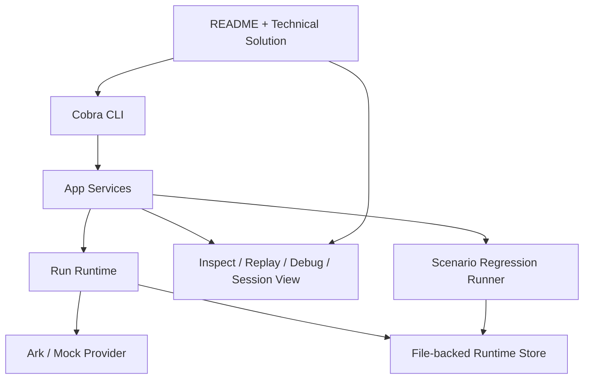

## Context

当前 Harness 已经不再是 greenfield：仓库中已经有可运行的 CLI、本地 `.runtime/` 工件、结构化计划、上下文组装、长期记忆、文件系统工具、多轮 chat 和受控 child run delegation。现阶段更大的问题不再是“缺少哪块基础能力”，而是这些能力在真实运行时中的稳定性、可验证性和可维护性是否足够支撑下一轮扩展。

从当前实现状态可以看到几个具体信号：

- 真实 provider 路径仍可能留下未收口的 `running` run。
- `resume` 已具备基础能力，但恢复边界和端到端验证还不够明确。
- 项目已经有不少单元测试和流程测试，但还缺少面向使用场景的固定回归入口。
- 当前 `inspect`、`replay` 和 `debug events` 已可用，但输出更偏“能看”，还没有完全做到“适合快速排障”。
- 文档与实现存在轻微漂移，尤其是技术方案文档仍带有早期阶段描述。

本次变更的目标是对现有 MVP 做一次“运行时收口”，让系统从“功能已实现”进入“可以稳定验证、便于继续演进”的阶段。

本次变更继续遵循当前项目的既有约束：

- 仍然只支持单机本地运行
- 仍然以 Cobra CLI 为唯一入口
- 仍然以文件型工件和 event-first 为核心
- 不引入 HTTP、MCP、ACP、消息代理或新的持久化后端
- 不扩大产品边界，重点放在稳定性、回归和调试体验

## Goals / Non-Goals

**Goals**

- 收口 Ark provider、工具执行和内部异常场景下的 `Run` 状态流转
- 明确 `resume` 的恢复边界，并补齐恢复相关测试
- 固化一组可重复执行的回归场景和统一验证入口
- 增强 session、run、child run 维度的调试可观察性
- 让 README 和技术方案文档与当前实现状态对齐
- 为下一轮 `plan.updated`、工具权限和服务化边界整理更清晰的演进基础

**Non-Goals**

- 不在本次变更中新增远程 API 或服务化入口
- 不在本次变更中引入新的模型供应商或新的持久化方案
- 不扩展复杂的新工具类型，只为现有工具体系梳理边界
- 不重写现有 runtime 架构，不改变 `Run / Session / Event` 的基础建模
- 不在本次变更中实现全新的 planner 策略，只为下一轮 replan 收口规则做准备

## Decisions

### 1. 把“失败收口”视为运行时第一优先级，而不是 provider 内部细节

本次变更不把 Ark 调用异常只当成 provider 层问题处理，而是把它视为整个 runtime 状态机的一部分。也就是说，无论失败来源是网络超时、响应格式错误、工具执行错误还是内部异常，最终都必须落成：

- 明确的 `Run` 终态
- 明确的失败原因
- 连续可读的事件链

这样设计的原因是：

- 用户真正感知到的问题不是“provider 报错了”，而是“run 卡住了”
- `resume`、`inspect`、`replay` 都依赖稳定的状态收口
- 后续即使更换模型 provider，运行时约束仍然成立

### 2. `resume` 只恢复“可以继续”的运行，不兜底所有中间态

本次变更不追求把所有异常状态都自动恢复，而是显式定义可恢复条件。推荐将恢复逻辑收敛为：

- `pending` 的 run：可重新激活并继续执行
- `running` 且没有终结事件的 run：可按当前状态继续恢复
- `blocked`：本次变更中不自动恢复，应返回清晰说明并等待人工处理
- `completed` / `failed` / `cancelled`：不可恢复，只返回清晰说明

这样设计的原因是：

- 恢复边界越模糊，越容易引入重复执行和状态污染
- 先让“少数典型中断场景”可靠恢复，比“所有状态都尝试恢复”更稳妥

### 3. 回归验证采用“固定场景 + 固定事件/工件断言”，而不是只依赖包级测试

现有单元测试和流程测试仍然保留，但本次变更额外引入固定回归场景，覆盖至少：

- 基础规划
- 文件系统工具
- 多轮 chat
- delegation

每条场景不只看命令是否成功，还要断言：

- 必须出现的关键事件
- 必须生成的工件
- 输出是否符合最小预期

这样设计的原因是：

- 当前项目已经具备多模块协同，单个包测试不够反映真实闭环
- 回归入口应该更接近用户真实使用方式

### 4. 调试体验按三个视角分层，而不是继续堆在单个输出里

本次变更建议明确区分三类查看方式：

- `inspect`：看当前 run 的摘要状态
- `replay`：按阶段读执行过程
- `debug events`：看原始事件

同时补一个 session 维度视角，用于回答“这个会话最近发生了什么”。这样设计的原因是：

- 当前工具已经足够多，如果每个命令都试图兼顾“摘要”和“原始排障”，可读性会下降
- session 级排障和 run 级排障是两个不同问题

### 5. 文档同步本身属于运行时收口的一部分

本次变更把 README 和技术方案同步纳入正式任务，而不是当作最后的附带工作。因为当前文档已经开始承担 onboarding 和范围控制作用，如果继续滞后，后续 change 的 proposal、design 和实现都会受影响。

### 6. 下一轮能力扩展以前，先把 replan 和工具权限边界说清楚

本次变更不会直接实现新的规划系统或大量新工具，但会为下一阶段明确两个边界：

- child run 返回 `needs_replan=true` 时，主运行应如何触发 `plan.updated`
- delegation 与工具系统之间的权限边界应如何表达

这样设计的原因是：

- 当前系统已经具备 delegation 与多轮上下文，如果不先收口边界，再继续扩工具或扩入口层会更混乱

## Architecture

本次变更不重写当前架构，而是在现有结构上补足稳定性和可观察性层：



设计重点不是引入新层，而是把已有层之间的约束说清楚：

- Provider 错误必须上浮到 runtime 终态
- Runtime 状态必须能被 store 和 debug 命令稳定消费
- 回归场景必须基于真实 CLI / 工件行为验证
- 文档必须反映当前 runtime 和调试入口的真实行为

## Runtime Behavior Changes

### 1. 失败路径统一进入标准终态

当模型调用、工具调用或内部逻辑出现异常时，系统应统一执行：

1. 记录失败前的关键上下文事件
2. 写入结构化失败事件或状态变化事件
3. 更新 `run.json` 和 `state.json`
4. 让 `inspect`、`replay`、`resume` 能基于一致状态工作

这里的关键不是新增很多事件名，而是保证已有事件契约在失败路径上也完整。

### 2. 恢复逻辑围绕“当前 step 连续性”

`resume` 恢复的核心对象不是“整个程序流程”，而是：

- 当前 `Run` 状态
- 当前 `PlanStep`
- 已写入的事件与结果
- 是否已经生成终结结果

恢复后应优先保证：

- 不重复执行已经完成的 step
- 不丢失上次执行前已经持久化的上下文
- 不把已完成 run 当成可恢复 run

### 3. 调试输出增加 child run 和 session 维度信息

由于当前系统已经支持多轮 chat 和 delegation，单看 run 本身有时不够。调试视图建议增加：

- run 当前 step 和最近失败点
- child run 是否创建、是否完成、摘要是什么
- session 最近消息和关联 run 列表

## Regression Strategy

推荐为本次变更增加统一的场景定义结构。每条场景至少包含：

- 场景名称
- 输入命令或输入说明
- provider 类型
- 期望事件列表
- 期望工件列表
- 成功输出断言

可采用如下思路：

```text
scenario/
  basic-plan/
  filesystem-tool/
  multi-turn-chat/
  delegation/
```

每条场景既可用于本地手工验证，也可用于统一命令执行。

## Affected Modules

- `internal/model/ark`
  负责 Ark 请求超时、错误分类和失败信息整理
- `internal/app`
  负责 runtime 状态收口、恢复规则、inspect/replay/session 查看逻辑
- `internal/cli`
  负责新的调试输出和 session 级查看入口
- `internal/store/filesystem`
  负责让恢复与回归场景能够稳定读取运行工件
- `README.md`
  负责对外说明当前能力和推荐验证路径
- `docs/step1/TECHNICAL_SOLUTION.md`
  负责同步整体实现阶段和演进方向

## Open Questions

- session 维度查看命令是否要独立成新命令，还是先以内建到现有 `chat` / `inspect` 体系中为主
- 回归场景更适合用测试代码驱动，还是用 `Makefile + testdata` 约定驱动
- `blocked` 状态在当前系统里是否需要更清晰的语义，还是先统一收口到 `failed` 更简单
