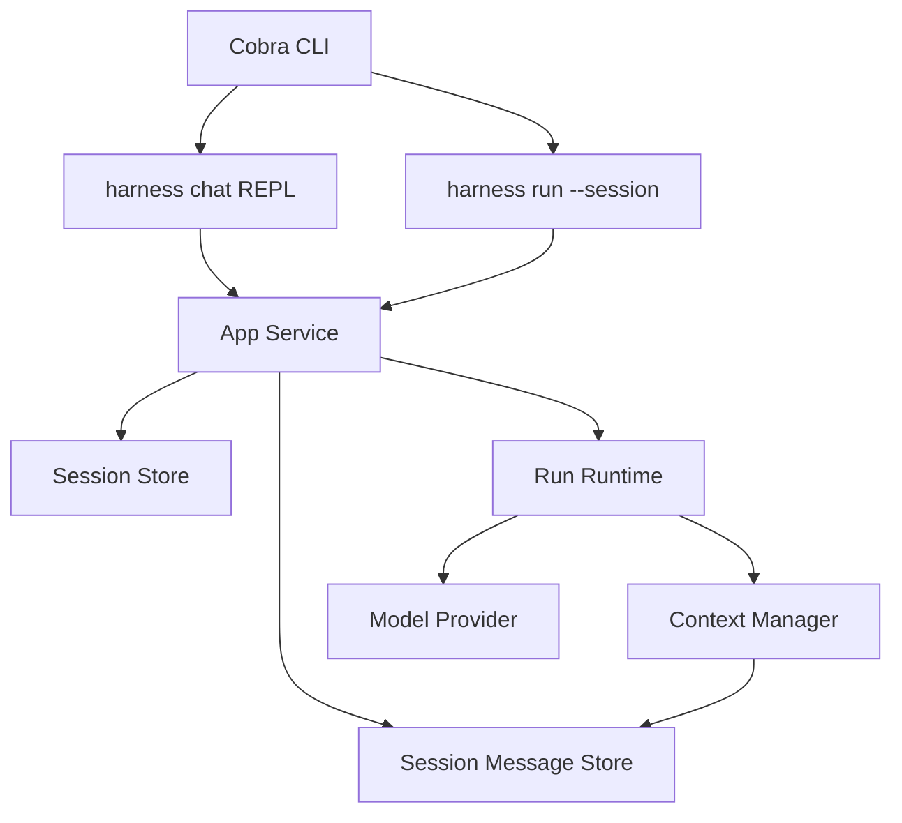

## Context

当前 Harness 已经具备单次 `run` 能力、文件型运行时工件、结构化计划、上下文构建、长期记忆和受控 delegation，但用户级交互仍然是“一次输入对应一次新的 Session”。这使得系统虽然具备内部多 step / 多 tool / 多 turn 的 agent loop，却缺少最基本的用户多轮对话体验。

对于本地 CLI 场景，多轮对话模式的目标不是构建一个完整聊天平台，而是在现有 `Run / Session / Event` 模型上补齐“同一 Session 下的连续输入输出”闭环，让用户可以：

- 在同一个 session 中持续追问
- 退出后通过 session id 继续对话
- 让最近消息历史进入下一轮 prompt/context
- 保持现有单次 `run`、inspect、replay、resume 能力不被破坏

本次变更仍然遵循当前项目的既有约束：

- 仅支持单机本地运行
- 仍以 Cobra CLI 为入口
- 仍以文件型工件和 event-first 为核心
- 不引入 HTTP、WebSocket、MessageProxy 或多人共享会话

## Goals / Non-Goals

**Goals**

- 支持同一个 `Session` 中的多轮用户消息与多次 `Run`
- 提供 `harness chat` 交互式命令
- 支持 `harness run --session <session-id>` 追加单轮输入到已有会话
- 持久化会话级消息历史，并在下一轮上下文中注入最近消息
- 为用户消息和助手消息增加结构化事件

**Non-Goals**

- 不实现流式 token 输出
- 不实现多人共享会话或远程会话存储
- 不在本次变更中引入 HTTP 聊天接口
- 不实现复杂的会话分支、消息编辑、消息删除
- 不改变当前 `Run` 仍然是一次执行实例的核心建模

## Decisions

### 1. 多轮对话基于“同一 Session 下的多次 Run”

本次变更不把多轮对话建模成“一个 run 持续常驻”，而是建模成：

- 一个 `Session` 承载连续对话
- 每一轮用户输入都会创建一个新的 `Task`
- 每一轮用户输入都会触发一个新的 `Run`
- 多个 run 共享同一个 `Session`

这样设计的原因是：

- 保持当前 `Run = 一次执行实例` 的模型不变
- 复用现有 run 工件、replay、resume、inspect 能力
- 让多轮对话只是“在已有平台模型上增加 session 续聊能力”

### 2. 会话消息独立持久化到 session 目录

会话历史不放在单个 run 目录中，而是保存在：

`/.runtime/sessions/<session-id>/messages.jsonl`

每条消息至少包含：

- `id`
- `session_id`
- `run_id`
- `role` (`user` / `assistant`)
- `content`
- `created_at`

这样设计的原因是：

- 消息天然属于 `Session` 范围，而不是某个单独 run
- 同一个 session 下可以追踪多次 run 的输入输出
- 后续继续扩展 session inspect、history、message search 会更自然

### 3. 增加交互式 `harness chat`，并保留 `harness run --session`

本次变更同时提供两种续聊方式：

- `harness chat`
  - 启动交互式 REPL
  - 默认创建新 session
  - 支持 `--session` 继续已有会话
  - 支持 `/exit`、`/quit`

- `harness run --session <session-id> <instruction>`
  - 适合非交互方式向已有会话追加一轮输入

这样设计的原因是：

- `chat` 提供自然的本地多轮体验
- `run --session` 便于脚本化和测试

### 4. 上下文组装只注入最近会话消息，而不是全量历史

为了避免 prompt 膨胀，本次变更不把整个 session 历史全部注入上下文，而是由 `ContextManager` 负责读取最近若干条消息，并将其作为“Conversation History”片段加入模型上下文。

第一版策略：

- 默认注入最近 `6` 条消息
- 保持顺序
- 优先保留最近 user/assistant 交替消息
- 仍与 `Pinned Context`、`Plan`、`Summaries`、`Memories` 并存

这样设计的原因是：

- 满足多轮对话最核心的连续性需求
- 不会立刻把 compaction 复杂度显著提高
- 后续如果要更智能裁剪会话历史，还可以继续演进

### 5. 会话消息也进入事件流

除 `messages.jsonl` 外，系统还要在对应 run 的 `events.jsonl` 中记录：

- `user.message`
- `assistant.message`

这样设计的原因是：

- replay 时可以直接看到本轮用户输入与助手输出
- 保持 event-first 一致性
- 不需要为了看消息历史只能去翻 session 文件

### 6. 首版不改变 planner 的整体策略

多轮对话模式不会引入新的 planner 形态。每次新的用户输入仍然独立创建当前 run 的 plan，但 planner 可以从会话历史中获得上下文，因而更容易理解“这轮问题是在延续上一轮”。

这样设计的原因是：

- 避免把“多轮聊天”和“跨轮计划协同”两个复杂问题同时放进本次 change
- 保持实现范围集中在 session/message/context 层

## Architecture



## Data Model Changes

新增 `SessionMessage`：

```go
type SessionMessage struct {
    ID        string    `json:"id"`
    SessionID string    `json:"session_id"`
    RunID     string    `json:"run_id"`
    Role      string    `json:"role"`
    Content   string    `json:"content"`
    CreatedAt time.Time `json:"created_at"`
}
```

新增工件路径：

- `.runtime/sessions/<session-id>/messages.jsonl`

## Open Questions

- 第一版 `harness chat` 是否需要支持多行输入。目前建议先不支持，按“一行一轮”处理，后续再扩展。
