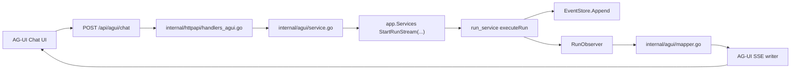

## Context

当前项目已经有两条稳定能力：

- 基于 CLI 和 `.runtime` 工件的运行时主链
- 基于 `chi` 的本地调试 API 和 Web UI

但现有 Web UI 仍然偏“调试台”，核心页面围绕 `inspect / replay / events` 组织，用户在发起一次对话后无法自然地感受到：

- assistant 文本逐步出现
- step 实时变化
- tool call 的完整过程
- run 生命周期的即时反馈

AG-UI 正好适合补这一层“chat-first”体验，但本次变更不应推翻现有 API，因为当前调试台已经提供了 inspect、replay、原始事件和会话/run 列表这些对开发排障很有价值的能力。

## Goals / Non-Goals

**Goals:**
- 新增一条与现有调试 API 并存的 AG-UI 兼容聊天入口
- 让运行时事件在持久化之外，还能被实时观察和转发
- 通过 HTTP + SSE 输出 AG-UI 兼容事件流
- 提供一个最小 chat-first 前端页面，用真实聊天界面验证 AG-UI 链路

**Non-Goals:**
- 不替换现有 `sessions / runs / replay / events` 调试 API
- 不在本次引入 WebSocket
- 不在本次实现完整的 AG-UI event 覆盖面，例如复杂 state delta 或 reasoning 流

## Decisions

### 1. 采用并存架构，而不是替换现有 API

本次新增：

- `POST /api/agui/chat`

现有：

- `POST /api/runs`
- `GET /api/runs/{id}`
- `GET /api/runs/{id}/replay`
- `GET /api/runs/{id}/events`
- `GET /api/sessions/*`

继续保留。

这样调试台和聊天体验各自有明确定位：

- 现有 API：面向调试、排障和运行态检查
- AG-UI：面向聊天体验和实时交互

### 2. 运行时增加 observer 旁路，而不是重写事件系统

当前 `run_service` 已经会把关键阶段写入 `EventStore`。最小改造不是改变事件来源，而是在事件写入时增加一个可选 observer：

- 事件仍然写入持久化存储
- 同一事件也可以广播给实时观察者

实现上优先通过一个统一 helper 包装 `EventStore.Append(...)`，避免在 `run_service` 中分散多套逻辑。

### 3. AG-UI 入口采用“真流式执行”，不做先执行后回放

如果 `POST /api/agui/chat` 只是内部调用同步 `StartRun`，等 run 完成后再回放事件，那么聊天体验只会比现有调试台多一层协议翻译，并不能真正解决问题。

因此本次选择：

- handler 先建立 SSE
- 应用层通过新的可观察执行入口启动 run
- runtime 事件随着执行即时推送给 AG-UI adapter
- adapter 逐步输出 AG-UI 事件

### 4. AG-UI 采用最小事件子集

v1 只覆盖最有价值的事件：

- `RUN_STARTED`
- `RUN_FINISHED`
- `RUN_ERROR`
- `MESSAGES_SNAPSHOT`
- `STATE_SNAPSHOT`
- `STEP_STARTED`
- `STEP_FINISHED`
- `TEXT_MESSAGE_START`
- `TEXT_MESSAGE_CONTENT`
- `TEXT_MESSAGE_END`
- `TOOL_CALL_START`
- `TOOL_CALL_ARGS`
- `TOOL_CALL_END`
- `TOOL_CALL_RESULT`
- `CUSTOM`
- `RAW`

这样足够支撑 chat-first 前端，同时保留未来继续细化的空间。

### 5. 先提供伪流式文本兼容，后续再接真正 token 级流式输出

当前模型层并没有现成 token 流接口，因此本次先支持：

- `TEXT_MESSAGE_START`
- 一条或少量 `TEXT_MESSAGE_CONTENT`
- `TEXT_MESSAGE_END`

即使初版内容还是整段输出，也先把前端协议形状定住。后续若模型层支持更细粒度流输出，可以继续增强而不推翻前端。

## Architecture

## Proposed Components

### `internal/agui`

- `request.go`
  - 定义 `POST /api/agui/chat` 请求体
- `types.go`
  - 定义最小 AG-UI 事件结构
- `mapper.go`
  - 将 runtime event 映射到 AG-UI event
- `service.go`
  - 协调 run 启动、observer 消费和事件流输出
- `sse.go`
  - 负责 SSE 编码和 flush

### 应用层扩展

- `run_service.go`
  - 新增可观察执行入口
  - 抽事件写入 helper，将事件同时持久化并转发给 observer

### HTTP 层扩展

- `handlers_agui.go`
  - 解析 AG-UI chat 请求
  - 设置 SSE headers
  - 调用 `internal/agui/service.go`

### 前端扩展

- 新增一个最小 `/chat` 页面
  - 输入一条用户消息
  - 直接消费 `/api/agui/chat`
  - 实时展示消息流、活动事件和最新状态快照
  - 不替换现有 launchpad / run / session 调试页

## API Shape

### `POST /api/agui/chat`

请求头：

- `Content-Type: application/json`
- `Accept: text/event-stream`

请求体包含：

- `threadId`
- `messages`
- `state.workspace`
- `state.provider`
- `state.model`
- `state.maxTurns`
- 可选 `runId`
- 可选 `context`

响应为 SSE，返回 AG-UI 兼容事件流。

## Event Mapping Strategy

| Runtime Event | AG-UI Event |
|---|---|
| `run.started` | `RUN_STARTED` |
| `run.completed` | `RUN_FINISHED` |
| `run.failed` | `RUN_ERROR` |
| `plan.step.started` | `STEP_STARTED` |
| `plan.step.completed` | `STEP_FINISHED` |
| `assistant.message` | `TEXT_MESSAGE_START/CONTENT/END` |
| `tool.called` | `TOOL_CALL_START` + `TOOL_CALL_ARGS` |
| `tool.succeeded` | `TOOL_CALL_END` + `TOOL_CALL_RESULT` |
| `plan.updated`, `subagent.*`, `memory.*` | `CUSTOM` or `RAW` |

## Risks / Trade-offs

- [风险] 可观察执行入口会增加 `run_service` 的复杂度
  → Mitigation: observer 设计为可选旁路，不改变默认同步路径的行为

- [风险] AG-UI 事件映射不完整
  → Mitigation: v1 优先实现最小事件子集，无法标准化的语义通过 `CUSTOM/RAW` 暴露

- [风险] 模型层暂时没有 token 级流输出
  → Mitigation: 先提供伪流式文本事件，保证 chat 页面协议形状先稳定

- [风险] 新的 AG-UI 聊天链路和现有调试链路信息重复
  → Mitigation: 明确两条链路定位不同，现有 API 继续承担 inspect/replay/debug 角色

## Migration Plan

1. 为应用层执行链增加 observer 旁路
2. 抽取事件写入 helper，保证持久化和实时观察共用同一出口
3. 新增 `internal/agui` 的 request / mapper / service / sse
4. 新增 `POST /api/agui/chat`
5. 用 mock provider 验证 AG-UI 事件顺序与终态收口
6. 增加一个最小 chat-first 页面，验证 AG-UI 链路的真实体验
